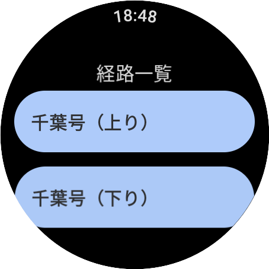
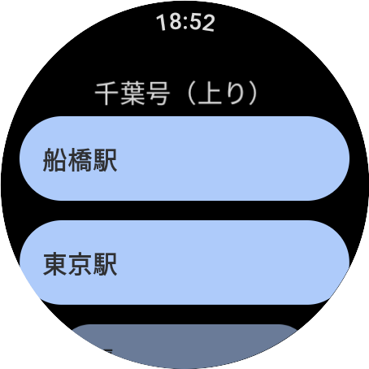
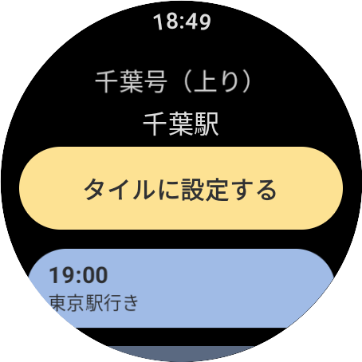
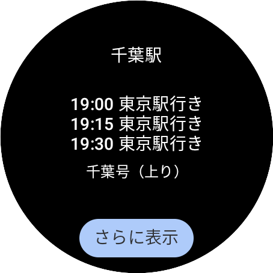
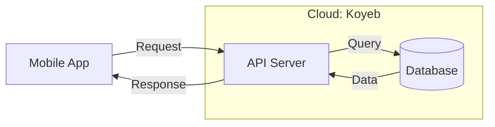

# Express Bus Time Table app
Ths is a simple WearOS app that provides a bus time table for a given route. 

# Features

## App
The app consists of the following three screens.

| Screen | Description | Screenshot |
|--------|-------------|------------|
| Route List Screen | Displays a list of available express bus routes. |  |
| Bus Stop List Screen | Displays a list of bus stops associated with the selected route. |  |
| Timetable Screen | Displays the timetable for the selected bus stop. You can also register bus stops to be shown on a tile. |  | 

## Tile

| Screen | Description | Screenshot |
|--------|-------------|------------|
| Tile | The tile displays the upcoming timetable for the registered bus stop. |  | 

# Architecure

# Tech Stack
- Mobile
    - Kotlin
    - Jetpack Compose
- Backend
    - Go
    - Echo
- Database
    - PostgreSQL
- Hosting
    - [Koyeb](https://www.koyeb.com/)