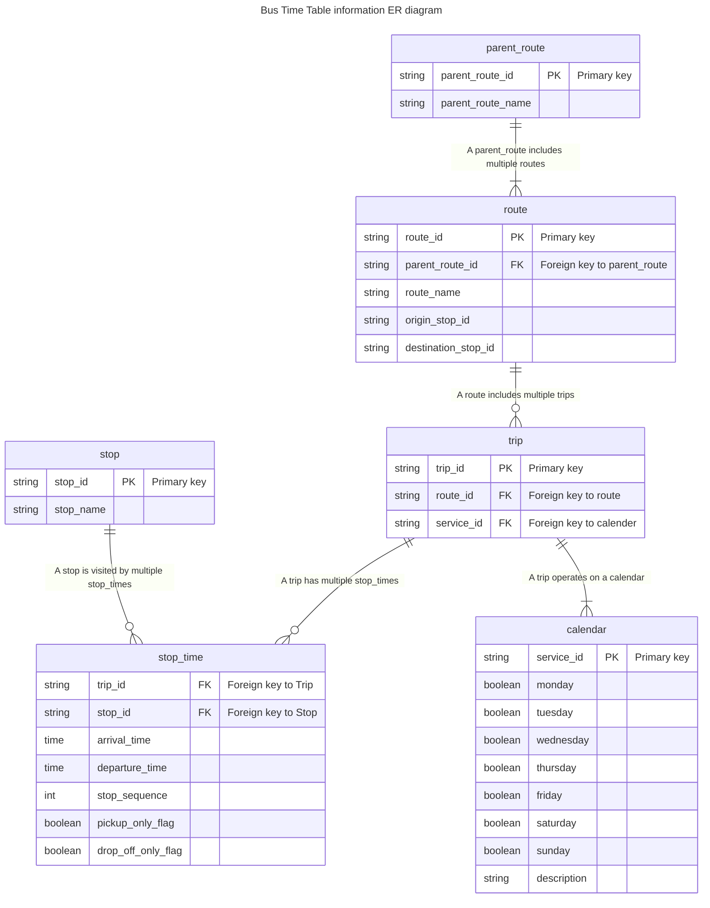

# Databse

## ER diagram

```mermaid
---
title: Bus Time Table information ER diagram
---
erDiagram
    parent_route {
        string parent_route_id PK "Primary key"
        string parent_route_name
    }

    route {
        string route_id PK "Primary key"
        string parent_route_id FK "Foreign key to parent_route"
        string route_name
        string origin_stop_id
        string destination_stop_id
    }

    stop {
        string stop_id PK "Primary key"
        string stop_name
    }

    trip {
        string trip_id PK "Primary key"
        string route_id FK "Foreign key to route"
        string service_id FK "Foreign key to calender"
    }

    stop_time {
        string trip_id FK "Foreign key to Trip"
        string stop_id FK "Foreign key to Stop"
        time arrival_time
        time departure_time
        int stop_sequence
        boolean pickup_only_flag
        boolean drop_off_only_flag
    }

    calendar {
        string service_id PK "Primary key"
        boolean monday
        boolean tuesday
        boolean wednesday
        boolean thursday
        boolean friday
        boolean saturday
        boolean sunday
        string description
    }

    parent_route ||--|{ route: "A parent_route includes multiple routes"
    route ||--o{ trip: "A route includes multiple trips"
    trip ||--o{ stop_time: "A trip has multiple stop_times"
    stop ||--o{ stop_time: "A stop is visited by multiple stop_times"
    trip ||--|{ calendar: "A trip operates on a calendar"

```
